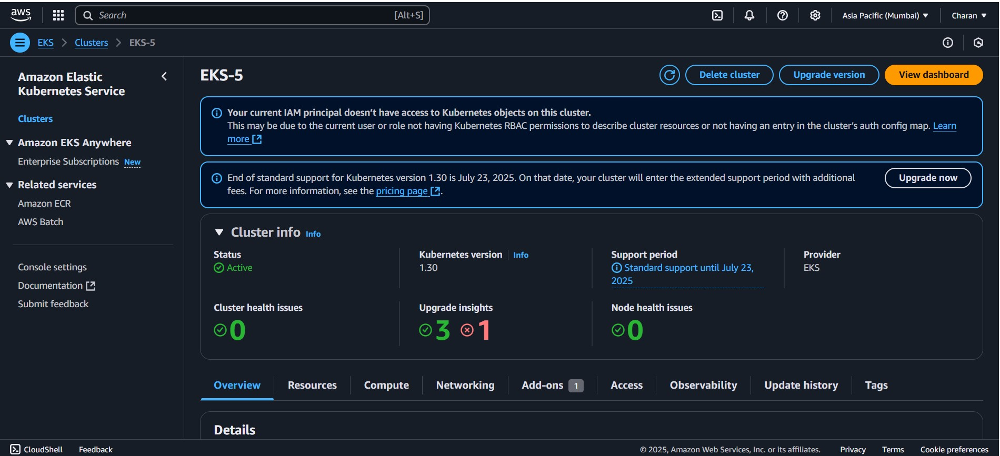

# 3-Tier Ultimate DevOps CICD Pipeline Project

The **3-Tier DevOps CI/CD Project** involves setting up a comprehensive pipeline with multiple stages across local, container, and cloud (Amazon EKS) environments, incorporating various tools such as Jenkins, SonarQube, TRIVY, Docker, and AWS services. Here's a breakdown of the deployment steps:

### Software & Tools Used:
1. **Git**
2. **Node.js**
3. **Jenkins**
4. **SonarQube Analysis**
5. **TRIVY (for file and image scanning)**
6. **Docker**
7. **Amazon EKS (Elastic Kubernetes Service)**

### Deployment Types:
1. **Local Deployment**
2. **Container Deployment (Docker)**
3. **Amazon EKS Deployment**

---
### Setup Local Environment:

1. Follow the below steps for creating a local Environment for our app deployment
    - create security group and allow all the ports in inbound rule as shown in below 
    - launch an EC2 instance for local deployment with ubuntu AMI, type t2.medium and EBS of 15 GB.
    - connect to EC2 instance using mobaXterm
    
2. Setting Up EC2 instance
    - update the ubuntu packages, "sudo apt update"
    - Install NodeJs on this ubuntu machine - https://nodejs.org/en/download
    Note : If the commands is not working in the document, continue installing nodejs with "sudo apt install nodejs" and "sudo apt install npm"
            nvm can be installed by using curl commands (search in google and install) - https://tecadmin.net/how-to-install-nvm-on-ubuntu-20-04/
            verify the versions and update them accordingly.
3. goto cloudinary website and sign up if you haven't had an account.
    - Copy the environmetnal credentials by clicking on view API Keys button.
    - copy the env variables from github repo as follows
   ```
        CLOUDINARY_CLOUD_NAME=
        CLOUDINARY_KEY=
        CLOUDINARY_SECRET=
        MAPBOX_TOKEN=
        DB_URL=" "
        SECRET=
```
    - Paste the credentials accordingly and keep it ready for configuration
4. goto mapbox and create an account if you don't have any
    - copy the public token and paste it in the env variables as specified above
5. goto mango db and crate an account 
    - create a connection based on requirement and click on create deployment
    - copy the username and password for db and keep it safe
    - copy the db url from create database connection and paste it in env variables
    - make database accessble from everywhere, goto network access settings and click on add IP address and allow 0.0.0.0/0
    - for SECRET in env variables you can add any
    
6. goto created local ubuntu machine and clone the application repository using git : https://github.com/Charan-DevOps-Git/3-Tier-DevOps-CICD-Pipeline-Project.git
7. check all the project necessary files are downloaded
    - gointo the folder directory of project
    - run 'npm install' command so that it will download all the necessary dependencies for the project.
    - open .env file using 'vi .env' command, paste all the env variables we have saved from previous steps and save the file.
    - now run 'npm start', you should get "database connected" text in the logs.
    - verify it by taking public ip of instance and port number you should be able to view the application
    - for testing purpose register with a user and navigate to db, there should be a record created with username we have given which mean our local deployment is sucessfully completed.
    

---

### Setup Dev Environment:

1. launch 2 new vm's with the following configuration
    - Jenkins server - Ubuntu, t2.large, 25 EBS
    - SonarQube server - ubuntu, t2.medium, 15 EBS
Jenkins server setup:
2. connect to each of the vm's using mobaXterm, update the current packages using 'sudo apt update' on both the machines
3. Jenkins machine, install java first using command "sudo apt install openjdk-17-jre-headless -y"
4. now install jenkins by using commands from jenkins website : https://www.jenkins.io/doc/book/installing/linux/#debianubuntu
5. Make a directory, create a file jenkins.sh and paste all the commands in the file. modify the executable permissions 'sudo chmod +x jenkins.sh'  and run it using './jenkins.sh'
6. After jenkins installtion continue installing docker, by using command "sudo apt  install docker.io -y"
7. Take public ip of jenkins and paste it on the broweser along with ip for accessing jenkins console
8. goto vm and access 'sudo cat /var/lib/jenkins/secrets/initialAdminPassword' location for password and paste it on console (keep it secure for future).
9. Install necessary plugins for jenkins and wait untill setup gets completed.
9. Docker will not be able to pull the images directly, for acheving that we will proceed with modifying permissions for docker by running command "sudo chmod 666 /var/run/docker.sock"
10. Test whether docker is able to pull the image or not with the command 'docker pull hello-world'.
11. once plugs installed, complete configuration of jenkins by creating user. you will be logged into jenkins
12. we have to install some necessary plugins for completing the project, goto dashboard -> manage jenkins -> plugins -> avaible plugins , serach and install the below plugins
    nodejs, SonarQube Scanner, docker, docker Pipeline, kubernetes, kubernetes CLI.
13. now proceed with installing tools : dashboard -> manage jenkins -> tools. configure sonarqube scanner, nodejs and docker tools as shown in below.


### SonarQube Server Setup:
1. for setting up docker container in the sonarqube server we have to install docker, by using command "sudo apt  install docker.io -y"
2. modify the permissions by running command "sudo chmod 666 /var/run/docker.sock", so ubuntu user can also be able to run the docker commands now.
3. now pull sonar qube image from docker hub, and run using the following command "docker run -d --name sonar -p 9000:9000 sonarqube:lts-community"
4. run 'docker ps' will show the created container and check whether we will able to access sonarqube or not using it's public ip and port
5. for logging into sonarqube the username and password will be admin, it will prompt for changing password. enter new password and login.

### Install TRIVY on jenkins machine:
1. goto the url for commands to install TRIVY : https://trivy.dev/v0.18.3/installation/
2. modify permissions and install TRIVY (ref: same as we done in jenkins)

### SonarQube Server Connection inside Jenkins:
1. For the configuration gollow teh below steps
    - SonarQube dashboard -> Administaration -> users -> tokens -> generate the token -> copy the token
    - go to jenkins -> manage jenkins -> credetials -> global -> add credentials -> kind : select secreat text -> paste copied token -> id and descriptions give sonar-token -> create
    - configure sonar qube server in jenkins -> jenkins dashboard -> Manage jenkins -> system -> add sonarqube installation. copy the sonarqube public ip with port and paste it on URL.


### Jenkins Pipeline:
1. Jenkins Dashboard -> create a job -> pipeline -> name of job -> create
2. use pipeline syntax for git,sonarqube,docker and include tools syntax for configuing tools in pipeline. create the below pipeline and execute it.
```
pipeline {
    agent any
    
    tools{
        nodejs 'node21'
    }
    
    environment {
        SCANNER_HOME= tool 'sonar-scanner'
    }
    stages {
        stage('Git Checkout') {
            steps {
               git branch: 'main', credentialsId: 'git-cred', url: 'https://github.com/Charan-DevOps-Git/3-Tier-DevOps-CICD-Pipeline-Project.git'
            }
        }
        stage('Install Package Dependencies') {
            steps {
                sh "npm install"
            }
        }
        stage('Unit Test Cases') {
            steps {
                sh "npm test"
            }
        }
        stage('TRIVY FS Scan') {
            steps {
                sh "trivy fs --format table -o fs-report.html ."
            }
        }
        stage('SonarQube') {
            steps {
                withSonarQubeEnv('sonar') {
                    sh "$SCANNER_HOME/bin/sonar-scanner -Dsonar.projectKey=Campground -Dsonar.projectName=CampgroundProject"
                }
            }
        }
        stage('Docker Build & Tag') {
            steps {
                script {
                    withDockerRegistry(credentialsId: 'docker-cred', toolName: 'docker') {
                        sh "docker build -t charandevopsdocker/camps:latest ."
                    }
                }
            }
        }
        stage('TRIVY Image Scan') {
            steps {
                sh "trivy image --format table -o fs-report.html charandevopsdocker/camps:latest"
            }
        }
        stage('Docker Push Image') {
            steps {
                script {
                    withDockerRegistry(credentialsId: 'docker-cred', toolName: 'docker') {
                        sh "docker push charandevopsdocker/camps:latest"
                    }
                }
            }
        }
          stage('Docker Deploy to Dev-env') {
            steps {
                script {
                    withDockerRegistry(credentialsId: 'docker-cred', toolName: 'docker') {
                        sh "docker-compose up -d"
                    }
                }
            }
        }
    }
}
```
3. verify the docker image pushed to your dockerhub repository
4. goto sonarqube server -> projects -> our project should be there with all the codesmels and vunarability details.
5. try to access deployed application in jenkins using docker port.
6. Test the application with dummy data on all the features and the changes will be saved on mangodb.


---

### Setup PROD Environment:
1. Setup EKS- Cluster use following commands for that
```
# AWSCLI
curl "https://awscli.amazonaws.com/awscli-exe-linux-x86_64.zip" -o "awscliv2.zip"
sudo apt install unzip
unzip awscliv2.zip
sudo ./aws/install
aws configure

# KUBECTL
curl -o kubectl https://amazon-eks.s3.us-west-2.amazonaws.com/1.19.6/2021-01-05/bin/linux/amd64/kubectl
chmod +x ./kubectl
sudo mv ./kubectl /usr/local/bin
kubectl version --short --client

# EKSCTL
curl --silent --location "https://github.com/weaveworks/eksctl/releases/latest/download/eksctl_$(uname -s)_amd64.tar.gz" | tar xz -C /tmp
sudo mv /tmp/eksctl /usr/local/bin
eksctl version
```
2. update the permissions as we did for execting the commands and run commands so that it will install all the requried configurations

3. goto IAM and create a user, Attach Policies to the newly created user as below 
```
AmazonEC2FullAccess

AmazonEKS_CNI_Policy

AmazonEKSClusterPolicy

AmazonEKSWorkerNodePolicy

AWSCloudFormationFullAccess

IAMFullAccess
```
- One more policy we need to create with content as below
```
{
    "Version": "2012-10-17",
    "Statement": [
        {
            "Sid": "VisualEditor0",
            "Effect": "Allow",
            "Action": "eks:*",
            "Resource": "*"
        }
    ]
}
```
- Attach this policy to your user as well

4. goto secrets manager and create access keys

5. now we proceed with creating eks cluster

### Create EKS CLUSTER
```
eksctl create cluster --name=EKS-5 \
                      --region=ap-south-1 \
                      --zones=ap-south-1a,ap-south-1b \
                      --version=1.30 \
                      --without-nodegroup
```
- after completing this config, run the following command
```
eksctl utils associate-iam-oidc-provider \
    --region ap-south-1 \
    --cluster EKS-5 \
    --approve
```
```
eksctl create nodegroup --cluster=EKS-5 \
                       --region=ap-south-1 \
                       --name=node2 \
                       --node-type=t3.medium \
                       --nodes=3 \
                       --nodes-min=2 \
                       --nodes-max=3 \
                       --node-volume-size=20 \
                       --ssh-access \
                       --ssh-public-key=DevOps_AMI_KP \
                       --managed \
                       --asg-access \
                       --external-dns-access \
                       --full-ecr-access \
                       --appmesh-access \
                       --alb-ingress-access
```
- Open INBOUND TRAFFIC IN ADDITIONAL Security Group and add all traffic

6. verify worker nodes are up or not using command : 'kubectl get nodes'  

### Create Servcie account/ROLE/BIND-ROLE/Token

- Create Service Account, Role & Assign that role, And create a secret for Service Account and geenrate a Token


### Creating Service Account
```
apiVersion: v1
kind: ServiceAccount
metadata:
  name: jenkins
  namespace: webapps
```
- kubectl apply -f srv.yml

### Create Role
```
apiVersion: rbac.authorization.k8s.io/v1
kind: Role
metadata:
  name: app-role
  namespace: webapps
rules:
  - apiGroups:
        - ""
        - apps
        - autoscaling
        - batch
        - extensions
        - policy
        - rbac.authorization.k8s.io
    resources:
      - pods
      - secrets
      - componentstatuses
      - configmaps
      - daemonsets
      - deployments
      - events
      - endpoints
      - horizontalpodautoscalers
      - ingress
      - jobs
      - limitranges
      - namespaces
      - nodes
      - pods
      - persistentvolumes
      - persistentvolumeclaims
      - resourcequotas
      - replicasets
      - replicationcontrollers
      - serviceaccounts
      - services
    verbs: ["get", "list", "watch", "create", "update", "patch", "delete"]
```
- kubectl apply -f rol.yml

### Bind the role to service account
```
apiVersion: rbac.authorization.k8s.io/v1
kind: RoleBinding
metadata:
  name: app-rolebinding
  namespace: webapps 
roleRef:
  apiGroup: rbac.authorization.k8s.io
  kind: Role
  name: app-role 
subjects:
- namespace: webapps 
  kind: ServiceAccount
  name: jenkins 
```
- kubectl apply -f bind.yml


7. Generate token using service account in the namespace : ```https://kubernetes.io/docs/reference/access-authn-authz/service-accounts-admin/#:~:text=To%20create%20a%20non%2Dexpiring,with%20that%20generated%20token%20data.```

```
apiVersion: v1
kind: Secret
type: kubernetes.io/service-account-token
metadata:
  name: mysecretname
  annotations:
    kubernetes.io/service-account.name: myserviceaccount
```
- kubectl apply -f sec.yml -n webapps

- kubectl describe secret mysecretname -n webapps

8. keep the secret key safe as of now, will be using it later in the process
9. goto jenkins server and create new pipeline for prod

```
pipeline {
    agent any
    
    tools{
        nodejs 'node21'
    }
    
    environment {
        SCANNER_HOME= tool 'sonar-scanner'
    }
    stages {
        stage('Git Checkout') {
            steps {
               git branch: 'main', credentialsId: 'git-cred', url: 'https://github.com/Charan-DevOps-Git/3-Tier-DevOps-CICD-Pipeline-Project.git'
            }
        }
        stage('Install Package Dependencies') {
            steps {
                sh "npm install"
            }
        }
        stage('Unit Test Cases') {
            steps {
                sh "npm test"
            }
        }
        stage('TRIVY FS Scan') {
            steps {
                sh "trivy fs --format table -o fs-report.html ."
            }
        }
        stage('SonarQube') {
            steps {
                withSonarQubeEnv('sonar') {
                    sh "$SCANNER_HOME/bin/sonar-scanner -Dsonar.projectKey=Campground -Dsonar.projectName=CampgroundProject"
                }
            }
        }
        stage('Docker Build & Tag') {
            steps {
                script {
                    withDockerRegistry(credentialsId: 'docker-cred', toolName: 'docker') {
                        sh "docker build -t charandevopsdocker/camprod:latest ."
                    }
                }
            }
        }
        stage('TRIVY Image Scan') {
            steps {
                sh "trivy image --format table -o fs-report.html charandevopsdocker/camprod:latest"
            }
        }
        stage('Docker Push Image') {
            steps {
                script {
                    withDockerRegistry(credentialsId: 'docker-cred', toolName: 'docker') {
                        sh "docker push charandevopsdocker/camprod:latest"
                    }
                }
            }
        }
        stage('Docker Deploy to Dev-env') {
            steps {
                script {
                    withDockerRegistry(credentialsId: 'docker-cred', toolName: 'docker') {
                     sh "docker-compose up -d"
                    }
                }
            }
        }
        stage('Docker Deploy to EKS') {
            steps {
                withKubeCredentials(kubectlCredentials: [[caCertificate: '', clusterName: 'EKS-5', contextName: '', credentialsId: 'k8-token', namespace: 'webapps', serverUrl: 'https://B30083A1BB782F20DC91F3BB4F08AF80.gr7.ap-south-1.eks.amazonaws.com']]) {
                    sh "kubectl apply -f dss.yml"
                    sleep 60
                }
            }
        }
        stage('Verify the Deployment') {
            steps {
                withKubeCredentials(kubectlCredentials: [[caCertificate: '', clusterName: 'EKS-5', contextName: '', credentialsId: 'k8-token', namespace: 'webapps', serverUrl: 'https://B30083A1BB782F20DC91F3BB4F08AF80.gr7.ap-south-1.eks.amazonaws.com']]) {
                    sh "kubectl get pods -n webapps"
                    sh "kubectl get svc -n webapps"
                }
            }
        }
    }
}
```




10. once it's done, check the logs by using command "kubectl get all -n webapps"
11. run the follwing command to check logs "kubectl logs <podname> -n webapps" it will show that your database is connected.
12. That's it your project is completed successfully.
---
